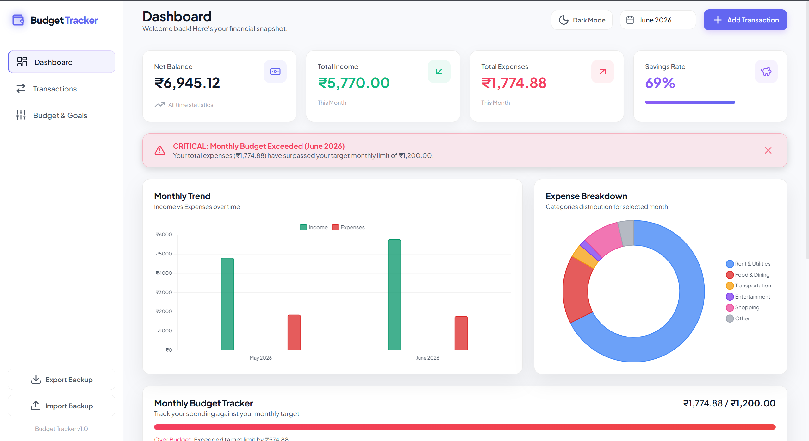
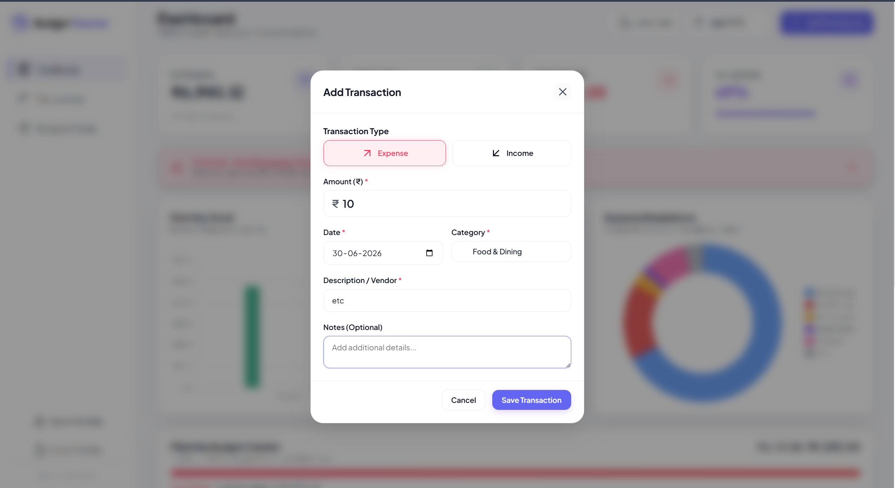
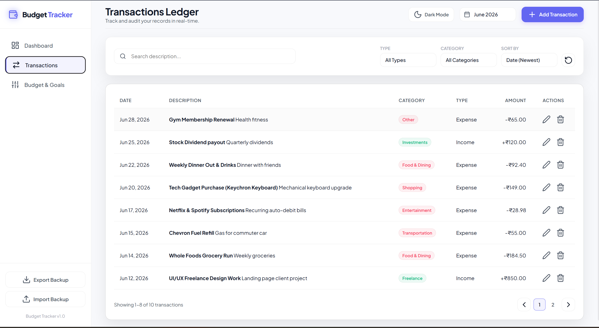
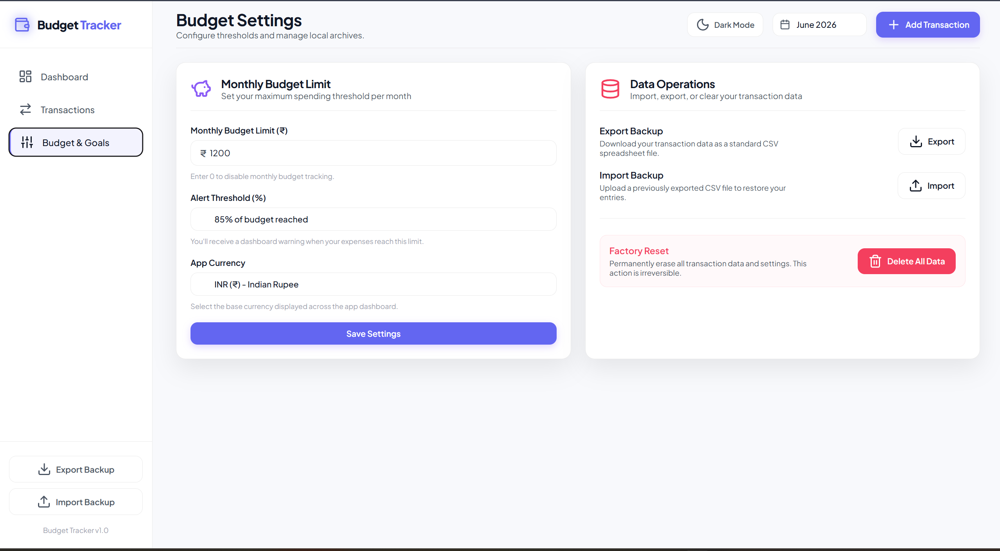

# 💸 Budget Tracker - Premium Personal Finance Manager

🚀 **[LIVE APP - Click Here to Use](https://taupe-khapse-e57086.netlify.app/)**

**Budget Tracker** is a sleek, premium, and fully responsive personal finance and budget tracking web application. It helps individuals and small businesses monitor their daily income and expenses with an intuitive, beautiful dashboard. The app operates entirely on the client side with automatic data persistence using browser `localStorage`.

---

## ✨ Key Features

### 📊 Financial Analytics & Insights
- **Real-time Metrics Dashboard:** Net Balance, Monthly Income, Monthly Expenses, and Savings Rate with visual progress indicators
- **Interactive Charts:**
  - Expense Breakdown (Donut Chart) - categorized spending analysis
  - Income vs Expense Trend (Bar Chart) - historical 6-month financial trends
- **Smart Insight Panel:** AI-powered monthly guidance based on your savings rate and budget status

### 💳 Complete Transaction Management (CRUD)
- **Add, Edit, Delete Transactions:** User-friendly modal-based form interface
- **Smart Categorization:** Context-aware categories for Income (Salary, Freelance, Investments) and Expenses (Food, Rent, Transportation, etc.)
- **Flexible Date & Timestamp Support:** Track transactions across any time period

### 🎯 Budget Planning & Alerts
- **Custom Monthly Budget Limits:** Set personalized spending targets
- **Visual Progress Tracking:** Animated progress bar (green → yellow → red)
- **Smart Alert Notifications:** Automatic warnings when spending reaches 85% or exceeds budget
- **Real-time Budget Status:** Current spending vs. target with visual indicators

### 🔍 Advanced Search & Filtering
- **Full-Text Search:** Search by description, category, or custom notes
- **Multi-Filter System:** Filter by transaction type, category, or date range
- **Smart Sorting:** Sort by date (ascending/descending) or amount (highest/lowest)
- **Pagination:** Clean, organized transaction ledger with page navigation

### 💾 Data Management
- **Export to CSV:** Backup all transactions as spreadsheet files
- **Import from CSV:** Restore previous backups with automatic parsing and merge logic
- **Factory Reset:** Clear all data with double-confirmation safety

### 🌓 Premium User Experience
- **Dark/Light Theme Toggle:** Glassmorphism design with smooth transitions
- **Fully Responsive:** Mobile-first design with collapsible sidebar, adaptive grids
- **Rich Micro-interactions:** Smooth animations, toast notifications, loading states

---

## 🛠️ Technical Approach & Architecture

### Frontend Stack
- **HTML5:** Semantic, accessible markup structure
- **CSS3:** Custom design system with CSS variables, Grid, Flexbox, and smooth transitions
- **Vanilla JavaScript:** No frameworks—lightweight, fast, and dependency-free
- **Chart.js CDN:** Interactive, responsive charts for data visualization
- **Lucide Icons CDN:** Beautiful, crisp SVG iconography

### State Management
- **Client-Side Only:** All data stored in browser `localStorage`
- **Reactive State Object:** Central state tree for transactions, filters, and UI state
- **Automatic Persistence:** Real-time syncing to localStorage on every transaction change
- **Fresh First Load:** New visitors start with an empty tracker and their data stays in their own browser

### Design System
- **CSS Custom Properties:** Unified theme (light/dark mode)
- **Responsive Grid System:** Mobile, tablet, desktop breakpoints
- **Glassmorphism Panels:** Modern translucent card design
- **Color Palettes:** Emerald (income), Rose (expenses), Indigo (accent), Violet (savings)

### Performance Optimizations
- **Minimal Dependencies:** No npm packages (except dev tools)
- **Lazy Chart Rendering:** Charts only regenerate when needed
- **Efficient DOM Updates:** Batch updates prevent layout thrashing
- **Optimized Build:** Production bundle ~32KB gzipped

---

## 📸 Screenshots & Demo

### Dashboard - Main Financial Overview

*Complete dashboard showing real-time metrics (Net Balance, Monthly Income, Monthly Expenses, Savings Rate), Smart Insight panel, Monthly Trend chart, Expense Breakdown donut chart, Budget Tracker with visual progress, and recent transactions preview.*

### Transaction Management - Add/Edit Modal

*Modal form interface for creating or editing transactions. Supports expense/income type selection, amount entry, date picker, smart category selection, and optional notes.*

### Transactions Ledger - Full Transaction History

*Complete transactions ledger view with search, advanced filtering (type, category, date range), sorting options, pagination, and inline edit/delete actions for all transactions.*

### Budget Settings & Data Management

*Settings tab with monthly budget limit configuration, alert threshold adjustment, multi-currency selector, Export/Import data as CSV, and Factory Reset option with double-confirmation safety.*

---

## 🚀 Setup & Installation

### Prerequisites
- **Node.js** (v16 or newer) - [Download](https://nodejs.org/)
- **Git** - [Download](https://git-scm.com/)

### Local Development

#### 1. Clone the Repository
```bash
git clone https://github.com/2200030440/azentrix-fullstack-task1.git
cd azentrix-fullstack-task1
```

#### 2. Install Dependencies
```bash
npm install
```

#### 3. Start Development Server
```bash
npm run dev
```
The app will automatically open at `http://localhost:3000`

#### 4. Build for Production
```bash
npm run build
```
Optimized files are generated in the `dist/` folder

#### 5. Preview Production Build
```bash
npm run preview
```

---

## 📁 Project Structure

```
azentrix-fullstack-task1/
├── index.html              # Main HTML entry point
├── app.js                  # Core application logic & state management
├── style.css               # Complete design system & responsive styles
├── vite.config.js          # Vite bundler configuration
├── netlify.toml            # Netlify deployment config
├── package.json            # Node.js dependencies & scripts
├── package-lock.json       # Locked dependency versions
├── .github/
│   └── workflows/
│       └── deploy.yml      # GitHub Actions CI/CD workflow
├── screenshots/            # UI demo images
│   ├── dashboard_final.png
│   ├── transaction_form.png
│   ├── settings_final_inr.png
│   └── ...
├── dist/                   # Production build output (auto-generated)
└── README.md               # This file
```

---

## 📖 How to Use

### Adding a Transaction
1. Click **"Add Transaction"** button (or **"+"** icon)
2. Select transaction type (Income/Expense)
3. Enter amount, date, category, and description
4. Optionally add notes
5. Click **Submit** to save

### Managing Budget
1. Go to **Budget & Goals** tab
2. Set your monthly budget limit (e.g., $1,200)
3. Set alert threshold (default: 85%)
4. Select your preferred currency
5. Changes save automatically

### Searching & Filtering
1. Use the **Search** field to find transactions by description
2. Filter by **Type** (Income/Expense)
3. Filter by **Category** (Salary, Rent, Food, etc.)
4. Filter by **Month** to view specific periods
5. Sort by **Date** or **Amount** (ascending/descending)

### Exporting & Importing Data
- **Export:** Click **"Export Backup"** to download transactions as CSV
- **Import:** Click **"Import Backup"** to restore a previous CSV backup
- **Reset:** Go to Settings and click **"Reset Data"** (with double confirmation)

### Theme Switching
- Click the **Moon/Sun** icon in the header to toggle between Dark and Light modes
- Your preference is remembered automatically

---

## 🔧 Configuration

### Customize Budget Categories
Edit the `CATEGORIES` object in `app.js`:
```javascript
const CATEGORIES = {
  income: ['Salary', 'Freelance', 'Investments', 'Gift', 'Other'],
  expense: [
    'Food & Dining', 
    'Rent & Utilities', 
    'Transportation', 
    'Entertainment', 
    'Shopping', 
    'Healthcare', 
    'Travel', 
    'Education', 
    'Other'
  ]
};
```

### Add New Currencies
Edit the `CURRENCY_CONFIGS` object:
```javascript
const CURRENCY_CONFIGS = {
  INR: { locale: 'en-IN', symbol: '₹' },
  USD: { locale: 'en-US', symbol: '$' },
  EUR: { locale: 'en-IE', symbol: '€' },
  // Add more...
};
```

---

## 💾 Data Storage

All data is stored locally in your browser using `localStorage`:
- **Transactions:** `aurabudget_transactions`
- **Budget Limit:** `aurabudget_budget_limit`
- **Alert Threshold:** `aurabudget_alert_threshold`
- **Currency:** `aurabudget_currency`
- **Theme:** `budgettracker_theme`

**Note:** Clearing browser storage will erase all data. Use **Export Backup** to save your data before clearing.

Each visitor has separate browser storage. The live app does not use a shared database, so one person's transactions are not visible to another person.

---

## 🚀 Deployment

### Deployed on Netlify (Recommended)
The app is currently deployed and live at:  
**[https://taupe-khapse-e57086.netlify.app/](https://taupe-khapse-e57086.netlify.app/)**

#### To Deploy Your Own Copy:
1. Fork this repository
2. Sign up at [Netlify](https://netlify.com)
3. Connect your GitHub repository
4. Click **Deploy** (Netlify auto-detects `netlify.toml`)
5. Your site will be live in 1-2 minutes

### Alternative Deployments
- **GitHub Pages:** Use `npm run build` and push `dist/` folder
- **Vercel:** Connect repository and auto-deploy
- **Firebase Hosting:** `firebase deploy`
- **Any static host:** Upload contents of `dist/` folder

---

## 🎯 Features Roadmap

**Planned for Future Versions:**
- [ ] Cloud sync (Firebase/Supabase backend)
- [ ] Recurring transaction templates
- [ ] Budget goal categories (separate from transaction categories)
- [ ] Advanced analytics (year-over-year trends)
- [ ] Mobile app (React Native/Flutter)
- [ ] Multi-user accounts & sharing

---

## 📄 License

This project is open source and available under the **MIT License**. Feel free to use, modify, and distribute as desired.

---

## 🤝 Support & Contribution

Found a bug or have a feature request?
- **GitHub Issues:** [Report a bug](https://github.com/2200030440/azentrix-fullstack-task1/issues)
- **Pull Requests:** Contributions welcome!

---

## 📞 Contact

For questions or feedback:
- **GitHub:** [@2200030440](https://github.com/2200030440)
- **Repository:** [azentrix-fullstack-task1](https://github.com/2200030440/azentrix-fullstack-task1)

---

**Last Updated:** June 2026  
**Version:** 1.0.0

## 🚀 Setup & Execution Instructions

Follow these simple steps to run AuraBudget on your local machine:

### 1. Prerequisites
Ensure you have [Node.js](https://nodejs.org/) (version 16 or newer) installed.

### 2. Installation
Open your terminal in the project directory and install the developer dependencies (Vite):
```bash
npm install
```

### 3. Run the Development Server
Launch Vite's local dev server:
```bash
npm run dev
```
The application will launch automatically in your default browser at **`http://localhost:3000`**. If it doesn't open automatically, navigate to that URL in your browser.

### 4. Build for Production
To bundle and compile optimized static files into the `dist/` folder:
```bash
npm run build
```

---

## 💡 Technical Approach & Choices

- **Vite (Dev Server):** Used as a zero-config local server tool. This provides hot module replacement (HMR) for styling and scripting updates, along with a production bundler.
- **Vanilla CSS (No Tailwind):** Formed a clean CSS stylesheet using custom properties (variables) to enable uniform themes, flexible layouts using CSS Grid and Flexbox, custom scrolls, and keyframe animations.
- **Chart.js via CDN:** Picked for rendering interactive charts. It handles responsiveness perfectly, features smooth initial hover/scale animations, and is light to load.
- **Lucide Icons via CDN:** Employed for consistent iconography. Rendered programmatically via `lucide.createIcons()` for crisp SVGs.
- **Clean HTML5 Semantic Structure:** Maximized compatibility and structure by styling standard tables, headings (`<h1>`, `<h3>`), sidebars (`<aside>`), and navigation buttons.

---

## 📄 License
This project is open-source. Feel free to use, modify, and distribute as desired.
